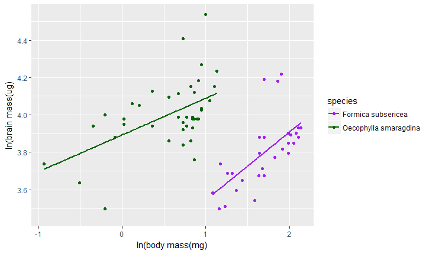

## Overview of the Paper

I will be ranalyzing data presented by Kamhi et al (2016): Social complexity influences brain investment and neural operation costs in ants. 

In this paper, the authors are using ants to test social brain theory. This theory states that the degree of social complexity of a group correlates with the amount of brain investment of the group's individuals, particularly investment in regions used for information integration. This is based on the hypothesis that higher social complexity requires individuals to have a greater cognitive ability in order to process a greater number of social interactions. If greater cognitive ability requires increased investment in neural tissue, any selection for increased social compledxity may imply selection for increased brain size.

This theory was mostly founded on studying primates as well as other social vertebrates. However, it has only recently been tested using social insects. The authors argue that insect social organization is in many ways fundamentally different from primate sociality, specifically because social insects often lack pair binding and lasting inter-individual recognition. Therefore, they hypothesize that the relation between brain evolution and social evolution may differ between primates and insects. To test this hypothesis, the authors collect data on the volume and energy use of functionally different brain regions in two closely related species of ants: Formica subsericea and Oecophylla smaragdina, the former ant considered to have lower social complexity than the latter. The results of this study indicate that although individuals of the more socially complex species have larger regions dedicated for information integration (which is consistenet with social brain theory), those regions may require less energy to maintain. Therefore, the authors argue that the relation between social complexity and brain investment may be more complex than orignally argued by social brain theory because increased investment in brain size may be offeset by reduced investment in brain maintenance. 

The authors' dataset consists of brain mass, brain region volume and brain region Cytochrome c Oxidase Activity (COX Activity, as a proxy for neuron metabolism) for each species. Each individual's data is also organized acording to age (callow = newly born, mature = at least 20 days old), head-width and colony ID. 

I will be recreating the authors' regression of brain size and body size for both species as well as the two boxplots contrasting relative volume and COX activity of each brain region for each species.

## Figure 2: Regression of brain Size and Body size

1) Require the readxl package and load the excel dataset. Here, this is done from the dataset loaded on your desktop. You can then use the dataset for making the figure by using the read_excel function.
```{r, eval=FALSE}
knitr::opts_chunk$set(echo = TRUE)
require(readxl)
ds<-"C:/Users/ZC/Desktop/Data-Reanalysis/COX ms data for Dryad.xlsx"
rs2<-read_excel(ds, sheet = 1)
```

2) To make the regression plots, make sure ggplot is running. 

First, determine your x and y variable within the ggplot function. Specify the data set (here, rs2) and both variables within the aes() function.  Note that in the original data set, the values are log transformed. Instead of manually modifying the dataset, just use the log() function around each variable within aes().  

Second, add the geom_point() function. 

Third, to show the linear regression lines, use the geom_smooth() function and set method to "lm". 

Fourth, to manually set the colors, use the scale_color_manual() function. Note that this manual organization requires that the colors be in the same order as are the variables in the data set. For example, here O.smargdina is prioritized before F.subsericea, so if we want O.smaragdina to be purple and F.subsericea to be green, we need to order the colors in the function as c("purple","dark green"). 

Note that if R orders incorrectly, such as automatically ordering alphabetically when you want them ordered in some other way, you can use the factor function after extracting the variable of interest from the data set in the following way

rs2$species <- factor(rs2$species, levels = c("species 3", "species 2","species 1"..)). Now, species 3 is manually set to be prioritized over the other species even if species 3 was originally deprioritized. 

Fifth, manually add the proper labels using the xlab() and ylab() functions to your plot function
```{r, eval=FALSE}
knitr::opts_chunk$set(echo = TRUE)

library(ggplot2)

Scalingplot<-ggplot(rs2, aes(x = log(body_mass_mg), y = log(ALL_estimated_brain_mass_by_species), colour = species)) 

Scalingplot<-Scalingplot + geom_point()

Scalingplot<-Scalingplot + geom_smooth(method="lm", fill=NA)

Scalingplot<-Scalingplot + scale_color_manual(values = c("purple", "dark green"))

Scalingplot<-Scalingplot + xlab("ln(body mass(mg)") + ylab("ln(brain mass(ug)") 

Scalingplot
```


## Figure 3(a): Box Plot of Relative Volumes of Brain Regions
Again, make sure have the data set loaded in R using the readxl() function. The first box plot uses the second sheet in the data set (brain region volume), so input sheet=2.
```{r, eval=FALSE}
knitr::opts_chunk$set(echo = TRUE)
require(readxl)
ds<-"C:/Users/ZC/Desktop/Data-Reanalysis/COX ms data for Dryad.xlsx"
bpd1<-read_excel(ds, sheet = 2)
```
The Data need to be reorganized to for it to be displayed as in Figure 2. We can use the melt() function of the reshape2 package to do this. In melt(), indicate the data set to be used (here, bpd1), id.vars = how you want the data divided in the legend (here, species) and measure.vars = c(ordered factors in the y variable)(here, these are the different relative volumes of the brain regions). Note that the order that the factors are input is the order that they will show on the boxplot.

```{r, eval=FALSE}
knitr::opts_chunk$set(echo = TRUE)
library(reshape2)
bpd2 <- melt(bpd1,id.vars="species",measure.vars=c('OL/brain','AL/brain', 'MB-MC/brain','MB-LC/brain','MB-lobes/brain','CC/brain','SEZ/brain'))

#species    variable    value

#Formica	OL/brain	0.101391919		
#Formica	OL/brain	0.111509346		
#Formica	OL/brain	0.117851347		
#Formica	OL/brain	0.102716292		
#Formica	OL/brain	0.110799555		
#Formica	OL/brain	0.115945377		
#Formica	OL/brain	0.116689930		
#Formica	OL/brain	0.107171498		
#Formica	OL/brain	0.125742862		
#Formica	OL/brain	0.120410460	
```
Now, the table is reorganized into 3 columns (species, variable and value). To start making the plot, load ggplot2, run the ggplot function on the melted data set (here, bpd2) and run the geom_boxplot(aes()) function with x = variable, y = value and color = species

```{r, eval=FALSE}
knitr::opts_chunk$set(echo = TRUE)
library(ggplot2)
plot1 <- ggplot(bpd2) +
      geom_boxplot(aes(x=variable, y=value, color=species))
```


Using the following functions, you can easily modify the aesthetics of the box plot as they are shown in Figure 2A. 
```{r, eval=FALSE}
knitr::opts_chunk$set(echo = TRUE)
#Modify the names of the factors 
plot1<-plot1 + scale_x_discrete(labels = c('OL', 'AL', 'MB-MC', 'MB-LC', 'MB-Lobes', 'CC', 'SEZ'))

#Modify the axis titles using the xlab(), ylab()
plot1<-plot1+ xlab("brain region") + ylab("relative volume")

#Modify colors and legend titles of the 2 species
plot1<-plot1 + scale_color_manual(labels = c("F.subsericea", "O.smaragdina major"), values = c("purple", "green"))
plot1<-plot1 + theme(legend.text = element_text(colour="black", size = 10, face = "italic"))
plot1
```


Repeat the same set of codes for making the second boxplot with the exception of using sheet 3 and modifying the labels appropriately to recreate Figure 3B

```{r, eval=FALSE}
knitr::opts_chunk$set(echo = TRUE)
library(ggplot2)
require(readxl)
library(reshape2)
ds<-"C:/Users/ZC/Desktop/Data-Reanalysis/COX ms data for Dryad.xlsx"
bpd3<-read_excel(ds, sheet = 3)
bpd4<-melt(bpd3,id.vars="species",measure.vars=c('OL','AL', 'MB-MC','MB-LC','MB-lobes','CC','SEZ','ROCB'))
plot2 <- ggplot(bpd4) +
      geom_boxplot(aes(x=variable, y=value, color=species))
plot2<-plot2 + scale_x_discrete(labels = c('OL', 'AL', 'MB-MC', 'MB-LC', 'MB-Lobes', 'CC', 'SEZ','ROCB'))
plot2<-plot2+ xlab("brain region") + ylab("COX Activity")
plot2<-plot2+ scale_color_manual(labels = c("F.subsericea", "O.smaragdina major"), values = c("purple", "green"))
plot2<-plot2 + theme(legend.text = element_text(colour="black", size = 10, face = "italic"))
plot2
```

